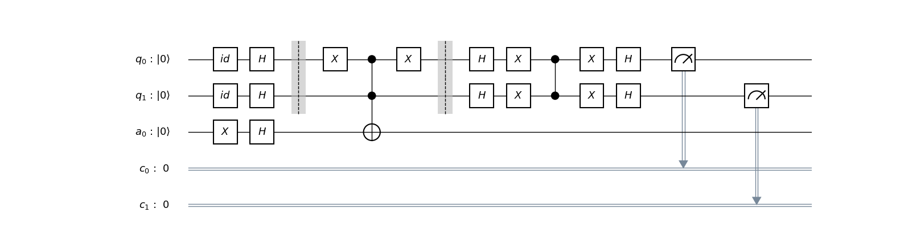

# qc-grovers
Notes about quantum computing, in particular about Grover's algorithm

In this repository I explain the well-known Quantum Grover's Algorithm (see this [link](https://en.wikipedia.org/wiki/Grover%27s_algorithm) for more detail) step by step, using [qiskit](https://github.com/Qiskit/qiskit) framework for the implementation.

This personal repository started as some notes in a notebook, however I realized that although the algorithm was quite documented, I did not find any presentation that explained it step by step.

The beamer presentation qc-grovers_v\<version\>.pdf is structured as following:
1. Grover's algorithm
    1. Motivation and Outline
    2. Steps
2. Implementation of Grover's algorithm: 2-Qubit States
   2.1 Quantum circuit
   2.2 IBM Implementation 
3. References (*the reader can find them in the next section*)

### References

- M. A. Nielsen and I. Chuang, “Quantum computation and quantum information,” 2002.
- G. Nannicini, “An introduction to quantum computing, without the physics,” CoRR, vol.
abs/1708.03684, 2017. [Online]. Available: http://arxiv.org/abs/1708.03684
- M. van der Lans, “Quantum algorithms and their implementation on quantum computer
simulators,” 2018. [Online]. Available: https://repository.tudelft.nl/islandora/object/uuid:
f05164dd-b853-41a1-a9e9-394cb7a1105e
- H. Abraham and I. Y. A. et al., “Qiskit: An open-source framework for quantum
computing,” 2019. [Online]. Available: https://doi.org/10.5281/zenodo.2562111

### Version
This is the first version (v1.0), so please, any comment is welcome